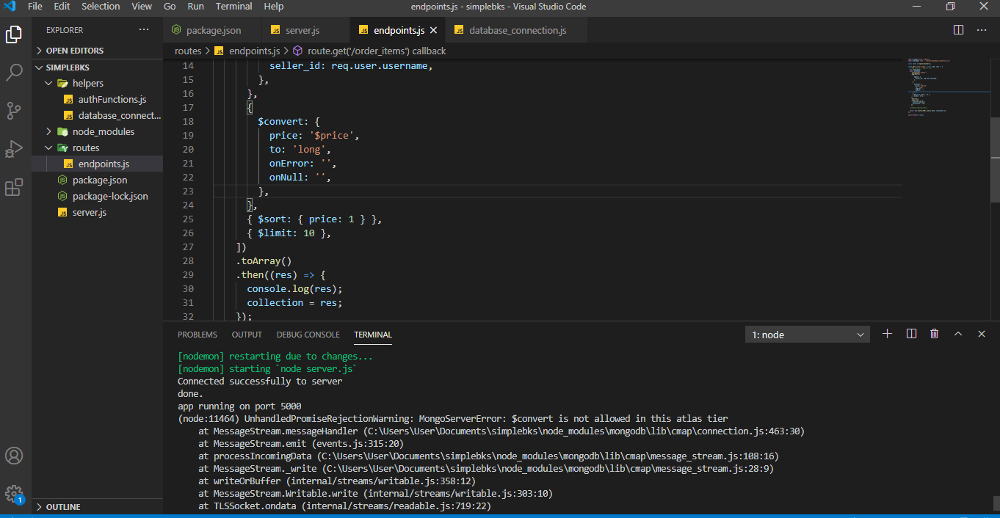

# Simplebks Task (Node.js)

This is solution to a node js [Test](https://www.notion.so/Task-Node-js-e5ff906068ac4b8abc245d33e7db5278) providing a REST
API which is beign deployed on [Heroku](https://simplebks.herokuapp.com). The the entry point to the application is `server.js` file.

## Install

    npm install

## Run the app(locally)

    after setting appropriate environment variables run node server.js

# REST API

The REST API to the example app is described below.

## Get list of orders

### Request

`GET /order_items/`

    endpoint -H 'Accept: application/json' https://simplebks.herokuapp.com/order_items

### Response

    HTTP/1.1 200 OK
    Date: Mon, 23 Aug 2021 09:56:13 GMT
    Status: 200 OK
    Connection: keep-alive
    Content-Type: application/json
    Content-Length: 882

    {}

## query parameter to sort by shipping_limit_date (default)

### Request

`GET /order_items?sortBy=shipping_limit_date`

    endpoint -H 'Accept: application/json' https://simplebks.herokuapp.com/order_items?sortBy=shipping_limit_date

### Response

    HTTP/1.1 200 OK
    Date: Mon, 23 Aug 2021 09:56:13 GMT
    Status: 200 OK
    Connection: keep-alive
    Content-Type: application/json
    Content-Length: 882

    {}

## query parameter to sort by price

### Request

`GET /order_items?sortBy=price`

    endpoint -H 'Accept: application/json' https://simplebks.herokuapp.com/order_items?sortBy=price

### Response

    HTTP/1.1 200 OK
    Date: Mon, 23 Aug 2021 09:56:13 GMT
    Status: 200 OK
    Connection: keep-alive
    Content-Type: application/json
    Content-Length: 882

    {}

## Allow showing from 20 (default) to up to 100 results at once with a limit parameter, and an offset query parameter to also easily get different result pages

### Request

`GET /order_items/limit?offset=value`

    endpoint -H 'Accept: application/json' https://simplebks.herokuapp.com/order_items/1?offset=1

### Response

    HTTP/1.1 200 OK
    Date: Mon, 23 Aug 2021 09:56:13 GMT
    Status: 200 OK
    Connection: keep-alive
    Content-Type: application/json
    Content-Length: 882

    {}

## Delete an order item ID from the order items collection, this will return an error message if `:id` doesnt match an order

### Request

`DELETE /order_items/:id`

    endpoint -H 'Accept: application/json' https://simplebks.herokuapp.com/order_items/:id

### Response

    HTTP/1.1 200 OK
    Date: Mon, 23 Aug 2021 09:56:13 GMT
    Status: 200 OK
    Connection: keep-alive
    Content-Type: application/json
    Content-Length: 882

    {message: 'order sucessfully deleted'}

## Update logged in seller's city or/and state. Should return new seller city and state as response. because city is compulsory this will return an error message if city is missing

### Request

`PUT /account/`

    endpoint -H 'Accept: application/json' -d(body) {"city"="Osogbo","state"="osun"} https://simplebks.herokuapp.com/account

### Response

    HTTP/1.1 201 Created
     Date: Mon, 23 Aug 2021 09:56:13 GMT
    Status: 201 Created
    Connection: close
    Content-Type: application/json
    Content-Length: 36

    {
    "message": "record successfully updated",
    "updated_record": {
        "seller_city": "Osogbo",
        "seller_state": "osun"
    }

}

## Run the tests

still working on the tests, Im have issues with running tests with jest, not with the code but jest

## PS

`please note that in the order collection, the fields: price and shipping_limit_date should be of type long and date respectively but were saved as strings, hence sorting might work function appropriately, I tried to convert the values but convert was not available on tier of atlas`

